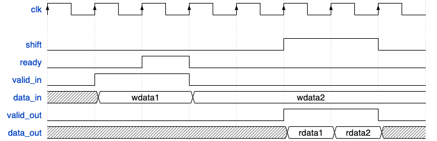

## Specifications

[TOC]

### 1. Overview

#### 1.1 CDB definition

`busy` Active high signal indicating there is valid data on the bus.

`tag[3:0]` The index of the ROB entry this data is aiming for.

`val[31:0]` The value of the data.

#### 1.2 Parameters

The number of ROB entries is 6. The number of registers is 32.The number of ALU reservation station entries is 5. The number of Load/Store buffer entries is 5. The number of CMP reservation station entries is 3. The number of instruction queue entries is 6.

#### 1.3 Signals

Note that all module have `clk` and `rst` signals. We ignore mentioning them in this specification.

#### 1.4 Usage of `vcs`

The command below is a perfect example of how to use it.

```
vcs -sverilog -top testbench -full64 hdl/include/rv32i_mux_types.sv hdl/include/rv32i_types.sv hdl/out_of_order_cpu/inst_queue.sv hvl/inst_queue/inst_queue_itf.sv hvl/inst_queue/top.sv
```

Note that the order of these modules matters. Be careful about the dependency.

Another way to simplify your dbugging process is to dump the file options into a single file without postfix, like `inst_queue_tb`. Then execute the following command in the terminal:

```
vcs -sverilog -full64 -f inst_queue_tb
```

You can look into this exact file in `hvl/inst_queue`.

### 2. Branch Predictor

#### 2.1 Port

**Port to instruction queue.**

`pc[31:0]`

The PC value of current instruction.

`pc_next[31:0]`

The next PC value after this instruction. If branch is involved, the pc_next is the jump destination address.

`instruction[31:0]`

The instruction itself.

`br_pred`

Set high if the corresponding instruction is a branch and is predicted as take. Otherwise is low.


**Port from instruction queue**

`iq_ready`

Signal indicating there is empty space in the instruction queue so that new instructions can be loaded.

**Port to cache.**

The memory interface.

`mem_read`

`mem_write`

`mem_byte_enable_cpu[3:0]`

`mem_address[31:0]`

`mem_wdata_cpu[31:0]`

32-bit data bus for sending data *to* the cache.

`mem_resp`

`mem_rdata_cpu[31:0]`

32-bit data bus for receiving data *from* the cache.

**Port from CMP.**

`br_en`

Branch enable signal *from* CMP.

`br_pred_res`

Signal indicating the result of this prediction. `1` means the prediction was successful, `0` means the prediction failed.

`br_target[31:0]`

The target address of the branch if there is one.

`br_pc[31:0]`

The corresponding PC of the branch instruction. This is used to update the BTB.

#### 2.2 Function

The branch predictor maintains the PC register. 

If opcode is not jal, jalr, branch (6 kinds), PC_next = PC_next + 4. If opcode is jal, PC_next = PC + imm. If opcode is jalr or branch (6 kinds), predict PC_next (always PC_next + 4 in the first version). br_en indicates the branch prediction for B branch.

### 3 Instruction queue

instruction queue entry

| PC (PC of this instruction) | next PC (PC of the next instruction right after this one) | br_pred (branch prediction result) | instruction |
| :-------------------------: | :-------------------------------------------------------: | :--------------------------------: | :---------: |

#### 3.1 Port

**Port to branch predictor**

`ready`

Asserted when there is empty space in the queue.

**Port from branch predictor.**

`valid_in`

Active high signal to indicate valid data is at the input ports.

`pc_in[31:0]`

The PC value of current instruction.

`pc_next_in[31:0]`

The next PC value after this instruction. If branch is involved, the pc_next is the jump destination address.

`inst_in[31:0]`

The instruction itself.

`br_pred_in`

The predicted branch. `1` means taken and  `0` means not taken.

**Port from decoder.**

`shift`

Active high signal that enables the instruction queue to shift downward, i.e. popping out the instructions.

**Port to decoder.**

`valid_out`

`pc_out[31:0]`

`pc_next_out[31:0]`

`inst_out[31:0]`

`br_pred_out`

**Control signal.**

`flush`

Active high signal that clears the whole queue.


#### 3.2 Functionality

The instruction queue takes in the instruction data from the branch predictor and passes it along its internel pipeline.

flush means branch misprediction and all instructions need to be omitted (new PC will be sent to branch predictor and then to instruction queue by PC_next).

If one entry does not hold valid instruction data, its value should be set to 32'b0.

#### 3.3 Implmentation

The instruction queue is a FIFO queue implemented by a shift register and a head pointer.



### 4 Decoder

#### 4.1 Port

**Port to regfile.**

`rs1[4:0]`

The index of the first register that we read.

`rs2[4:0]`

The index of the second register that we read.

**Port from regfile**

`reg_Qj[3:0]`

Register tag pertains to `rs1`. The index of ROB that contains the operation whose result should be stored into this register.

`reg_Vj[31:0]`

The value of the register. Valid only when `Qj` is 0.

`reg_Qk[3:0]`

Registe tag pertains to `rs2`.

`reg_Vk[31:0]`

Register data pertains to `rs2`.

**Port to ROB.**

`rob_Qj`

This signal indicates which entry we want to read for the first operand.

`rob_Qk`

This signal indicates which entry we want to read for the second operand.

`rob_valid`

Active high signal indicating a new instruction needs to be pushed into the ROB.

`rob_op[1:0]`

The type of the new instruction. There are 3 types: register, store and branch.

`rob_dest[31:0]`

The destination of this instruction. This can be the tag of ROB entry or the store address.

**Port from ROB.**

`rob_ready`

Active high signal from ROB indicating there is empty space in ROB.

`rob_Vj`

The read value from ROB.

`rob_Vk`

The read value from ROB.

**Port to ALU RS.**

`alu_Vj[31:0]`

The first operand.

`alu_Vk[31:0]`

The second operand.

`alu_Qj[3:0]`

The tag of the ROB entry that we will obtain the data Vj.

`alu_Qk[3:0]`

The tag of the ROB entry that we will obtain the data Vk.

`alu_op_type[2:0]`

This input indicates what kind of instruction it is.

`alu_dest[3:0]`

This is the ROB entry tag that indicates where the result of this operation should be stored.

`alu_valid`

Active high signal indicating there is a new operation produced.

**Port from ALU RS.**

`alu_ready`

**Port to CMP RS.**

`cmp_Vj[31:0]`

This is the value of the first operand for comparison.

`cmp_Vk[31:0]`

This is the value of the second operand for comparison.

`cmp_Qj[3:0]`

This indicates where `Vj` should come from.

`cmp_Qk[3:0]`

This indicates where `Vk` should come from.

`cmp_op[2:0]`

The opcode of comparator operation.

`br_pred_out`

The prediction of a branch (1 means take branch, 0 means not take).

`pc_out[31:0]`

The PC of this instruction.

`pc_next_out[31:0]`

The PC of the instruction right after the current one (prediction may involve).

`cmp_valid`

Active high signal indicating there is a new operation produced.

**Port from CMP RS.**

`cmp_ready`

**Port to Load/Store buffer**

`lsb_Vj[31:0]`

The first operand.

`lsb_Vk[31:0]`

The second operand.

`lsb_Qj[3:0]`

The tag of the ROB entry that we will obtain the data Vj.

`lsb_Qk[3:0]`

The tag of the ROB entry that we will obtain the data Vk.

`lsb_op_type`

This input indicates what kind of instruction it is. `1` means store and `0` means load.

`lsb_dest[3:0]`

This is the ROB entry tag that indicates where the result of this operation should be stored.

`lsb_valid`

Active high signal indicating there is a new operation produced.

**Port from Load/Store buffer.**

`lsb_ready`

**Port to intruction qeueu.**

`shift`

Active high signal that enables the instruction queue to shift downward, i.e. popping out the instructions.

**Port from instruction queue.**

`pc_in[31:0]`

The PC value of this instruction.

`pc_next_in[31:0]`

The potential jump target of this instruction (prediction may involve).

`inst_in[31:0]`

The instruction popped from the instruction queue. If the opcode of the instruction is 32'b0, it means the instruction is illegal and we ignore it.

`br_pred_in`

The prediction of a branch (1 means take branch, 0 means not take). This value is used later when the comparator produce the `br_en` signal to  give feedback to the branch predictor.

#### 4.2 Functionality

The decoder module put the right value into the ALU reservation station (RS). It is either a immediate from the instruction, existing register value from regfile, completed but not committed value from ROB, or ROB entry index of an uncompleted operation. The decoder must handle the relationship between `Q` and `V` properly.

### 5 ALU reservation station

#### 5.1 ALU RS entry

| tag  | busy | op. type |  Vj  |  Vk  |  Qj  |  Qk  | destination |
| :--: | :--: | :------: | :--: | :--: | :--: | :--: | :---------: |

If `Qj` or `Qk` is 0, it means the respective value is currently in `Vj` or `Vk`. Otherwise they refer to the ROB entry where the operands are fetched. `op. type` indicate the ALU operation type.

#### 5.2 Port

**Port to decoder.**

`ready`

Active high signal to indicate there is empty space in the reservation station.

**Port from decoder.**

`Vj_in[31:0]`

The first operand.

`Vk_in[31:0]`

The second operand.

`Qj_in[3:0]`

The tag of the ROB entry that we will obtain the data Vj.

`Qk_in[3:0]`

The tag of the ROB entry that we will obtain the data Vk.

`op_type[2:0]`

This input indicates what kind of instruction it is.

`dest_in[3:0]`

This is the ROB entry tag that indicates where the result of this operation should be stored.

**Port to ALU.**

`Vj_out[31:0]`

`Vk_out[31:0]`

`Qj_out[3:0]`

`Qk_out[3:0]`

`alu_op[2:0]`

This corresponds to the `op. type` field in the RS entry. It informs the ALU what operation to perform.

`dest_out[3:0]`

The destination of this operation. Represented by ROB index.

**Control signal.**

`flush`

Active high signal that clears all the entries in the ALU reservation station.

**Port from CDB**

`alu_res`

This is a `cdb_itf` type port that receives output from the ALU.

`cmp_res`

This is a `cdb_itf` type port that receives output from the comparator.

`mem_res`

This is a `cdb_itf` type port that receives output from the memory (data cache).

#### 5.3 Functionality

The ALU reservation station contains 5 entries for pending operations waiting to be done by ALU. The destination field indicates where the computed result should go.

### 6 ALU

#### 6.1 Port

**Port to decoder.**

`ready`

Active high signal to indicate there is empty space in the reservation station.

**Port from ALU RS**

`Vj[31:0]`

`Vk[31:0]`

`Qj[3:0]`

`Qk[3:0]`

`alu_op[2:0]`

`dest[3:0]`

This indicates where the result should go.

**Port to CDB**

`alu_out`

This is a `cdb_itf` type variable. 

#### 6.2 Functionality

The ALU computed a result given the two operands and operation type. Then it broadcasts the result onto the ALU-specific CDB.

### 7 Regfile

| Reg# | V[31:0] (register value) | Q[4:0] (register source tag) |
| :--: | :----------------------: | :--------------------------: |

#### 7.1 Port

**Port from ROB**

`rd`

The index of the destination register we want to write.

`val`

The value that we want to write to `rd`.

`load`

Active high signal that enables write operation.

**Port from decoder**

`rs1`

The index of the first register we read.

`rs2`

The index of the second register we read.

**Port to decoder**

`rs1_out`

The value inside `rs1`. If `t1_out` is not 0, this value is undefined (by default set to 0).

`rs2_out`

The value inside `rs2`. If `t2_out` is not 0, this value is undefined (by default set to 0).

`t1_out`

The tag attached to `rs1`.

`t2_out`

The tag attached to `rs2`.

**Control signal.**

`flush`

This clears all the tags attached to registers.

`reset`

This clears all the data in the regfile.

#### 7.2 Functionality

The regfile will check the `Q` field of the requested register and send back the correct value, i.e. if `Q` is 0, send back value in `V`, else send back `Q` itself. The regfile should complete reading within 1 cycle.

### 8 Comparator reservation station

#### 8.1 CMP RS entry

| busy | cmp_op |  Vj  |  Vk  |  Qj  |  Qk  | destination | br_pred | PC   | PC_next |
| :--: | :----: | :--: | :--: | :--: | :--: | :---------: | :-----: | ---- | ------- |


#### 8.2 Port

*Note: these ports can be packaged together for convenience.*

**Port to decoder**

`ready`

Active high signal to indicate there is empty space in the reservation station.

**Port from decoder.**

`Vj[31:0]`

This is the value of the first operand for comparison.

`Vk[31:0]`

This is the value of the second operand for comparison.

`Qj[3:0]`

This indicates where `Vj` should come from.

`Qk[3:0]`

This indicates where `Vk` should come from.

`cmp_op[2:0]`

The opcode of comparator operation.

`br_pred`

The prediction of a branch (1 means take branch, 0 means not take).

`pc[31:0]`

The PC of this instruction.

`pc_next[31:0]`

The PC of the instruction right after the current one (prediction may involve).

`dest_in`

The destination of this instruction (for `slt` instruction).

**Port to CMP.**

`Vj_out[31:0]`

`Vk_out[31:0]`

`cmp_op_out[2:0]`

`br_pred_out`

`pc_out[31:0]`

`pc_next_out[31:0]`

**Port from CDB**

`alu_res`

This is a `cdb_itf` type port that receives output from the ALU.

`cmp_res`

This is a `cdb_itf` type port that receives output from the comparator.

`mem_res`

This is a `cdb_itf` type port that receives output from the memory (data cache).

#### 8.3 Functionality

This reservation station holds the operands and operation type for instructions that involve comparator.

### 9 Comparator (CMP)

#### 9.1 Port

**Port from CMP RS.**

`Vj[31:0]`

`Vk[31:0]`

`cmp_op[2:0]`

`br_pred`

`pc_in[31:0]`

The PC of this instruction.

`pc_next[31:0]`

**Port to CDB.**

`cmp_out`

This is a `cdb_itf` type variable.

**Port to branch predictor.**

`pred_check`

If set to 1, the branch prediction was successful. Else, the prediction was wrong.

`pc_target[31:0]`

The address of the actual next instruction.

`pc_out[31:0]`

The PC of this instruction.

#### 9.2 Functionality

The comparator not only need to perform arithmetic operations, but check if the branch predictor was right and decide the true next PC.

### 10 Reorder buffer (ROB)

#### 10.1 ROB entry

| tag[3:0] | busy | inst. type[1:0] | destination[31:0] | value[31:0] | ready |
| :------: | :--: | :-------------: | :--------------: | :---------: | :---: |

`inst. type` can be branch, store or register operation.

`ready` indicates if this entry is ready to commit.

`destination` can be a register index or memory address (for store).

#### 10.2 Port

**Port from decoder.**

`valid_in`

Active high signal indicating a new instruction needs to be pushed into the ROB.

`op_type[1:0]`

The type of the new instruction. There are 3 types: register, store and branch.

`dest[31:0]`

The destination of this instruction. This can be the tag of ROB entry or the store address.

**Port to decoder.**

`ready`

Active high signal from ROB indicating there is empty space in ROB.

`Vj`

The read value from ROB.

`Vk`

The read value from ROB.

**Port from CDB**

`alu_res`

This is a `cdb_itf` type port that receives output from the ALU.

`cmp_res`

This is a `cdb_itf` type port that receives output from the comparator.

`mem_res`

This is a `cdb_itf` type port that receives output from the memory (data cache).

#### 10.3 Functionality

The ROB buffer maintains any instruction that is not ready to commit. It also properly manages the commiting of different kinds of instructions. Also, when any RS entry is requesting for register values that are not yet committed but already exist in the ROB, the ROB should be able to spread out these values.

1. If the instruction to commit is a branch and it is mispredicted, clear ROB and all pending registers. Then fetch the new instruction.
2. If the instruction to commit is a store, `Mem[destination] <- value`. 
3. Else, put the `value` in the `destination` register.
4. In all conditions, free up the tags on the registers that are associated with this ROB entry.

*Note: ROB should support read while write.*

### 11 Load/Store buffer

#### 11.1 Load/Store buffer entry

| busy | A |  Vj  |  Vk  |  Qj  |  Qk  | destination |
| :--: | :------: | :--: | :--: | :--: | :--: | :---------: |

For a load, `destination` is a ROB entry index indicating where the read data should go. For a store, `destination` is a ROB entry index indicating where the calculated effective address as well as the data to store should go.

`A` stores the immediate value from the memory instruction. `Vj` stores the value of the register for calculating address. `Vk` stores the value we want to wrote to memory (for store operation).

#### 11.2 Port

**Port to decoder**

`ready`

Active high signal to indicate there is empty space in the Load/Store buffer.

**Port from decoder**

`Vj[31:0]`

The first operand.

`Vk[31:0]`

The second operand.

`Qj[3:0]`

The tag of the ROB entry that we will obtain the data Vj.

`Qk[3:0]`

The tag of the ROB entry that we will obtain the data Vk.

`op_type`

This input indicates what kind of instruction it is. `1` means store and `0` means load.

`dest[3:0]`

This is the ROB entry tag that indicates where the result of this operation should be stored.

`valid`

Active high signal indicating there is a new operation coming in.

**Port to memory unit**

`mem_Vj[31:0]`

`mem_Vk[31:0]`

`mem_Qj[3:0]`

`mem_Qk[3:0]`

`mem_op`

This output indicates what kind of instruction it is. `1` means store and `0` means load.

`mem_dest[3:0]`

`mem_valid_out`

Active high signal indicating there is a new operation produced.

**Port from CDB**

`alu_res`

This is a `cdb_itf` type port that receives output from the ALU.

`cmp_res`

This is a `cdb_itf` type port that receives output from the comparator.

`mem_res`

This is a `cdb_itf` type port that receives output from the memory unit.

#### 11.3 Functionality

The load buffer store the effective address to load from and the destination ROB entry. It shares the functionality of a reservation station.

1. When Load instruction is issued, the immediate part is put into `A` field.
2. For load step 1, when `Vj` is ready the addition between `Vj` and `A` is performed and the result is again stored in `A`. This step can only execute when there are no stores earlier in the Load/Store buffer queue (not necessary?).
3. For load step 2, when load step 1 is done and all stores earlier in the ROB have differnet address.

### 12 Arbiter

#### 12.1 Port

**Port to/from data cache.**

`dcache_read`

Active high signal *from* data cache to enable next-level-cache read.

`dcache_write`

Active high signal *from* data cache to enable next-level-cache write.

`dcache_byte_enable_cpu[3:0]`

A mask *from* data cache describing which byte(s) of memory should be written on a write.

`dcache_address[31:0]`

`dcache_wdata_cpu[31:0]`

32-bit data bus for receive write data *from* data cache.

`dcache_resp`

Active high signal generated by the memory system indicating that the memory has finished the requested operation.

`dcache_rdata_cpu[31:0]`

32-bit data bus for sending read data *to* the data cache.

**Port to/from instruction cache.**

This is basically the same as ports with respect to data cache.

`icache_read`

`iache_write`

`icache_byte_enable_cpu[3:0]`

`icache_address[31:0]`

`icache_wdata_cpu[31:0]`

`icache_resp`

`icache_rdata_cpu[31:0]`

**Port to L2 cache.**

`
pmem_address[31:0]
`

Physical memory is accessed using this 32-bit signal. It specifies the physical memory address that is to be read or written.

`
pmem_rdata[255:0]
`

256-bit data bus for receiving data *from* physical memory.

`
pmem_wdata[255:0]
`

256-bit data bus for sending data *to* physical memory.

`
pmem_read
`

Active high signal that tells the memory interface that the address is valid and the cache is trying to perform a physical memory read.

`
pmem_write
`

Active high signal that tells the memory interface that the address is valid and the cache is trying to perform a physical memory write.

`
pmem_resp
`

Active high signal generated by the memory interface indicating that the memory operation has completed.

#### 12.2 Functionality

The arbiter will handle the requests from the 2 highest level caches, reasonably distribute the memory resources for them. Instruction fetch has a higher priority than data fetch. As a result, when there is a collision between the two caches, the arbiter should always serve the instruction request first.

### 13 Memory Unit

#### 13.1 Port

**Port to CDB**

`mem_res`

This is a `cdb_itf` type port that broadcasts memory read data or store addresses onto the CDB.

**Port from Load/Store buffer**

`Vj[31:0]`

`Vk[31:0]`

`Qj[3:0]`

`Qk[3:0]`

`mem_op`

`dest[3:0]`

`valid`

#### 13.2 Functionality

The memory unit resembles the ALU. While ALU executes the operations buffered in ALU reservation station, memory unit handles the memory operations buffered in Load/Store buffer.

1. If all necessary components of a load is ready, the memory unit will calculate the address and send the request to data cache (if it is available). If the data cache is being accessed by ROB during a store commit, the memory unit should wait until the memory write is over.
2. If all necessary components of a store is ready, the memory unit will calculate the effective address and broadcast the address and the data to store on the 